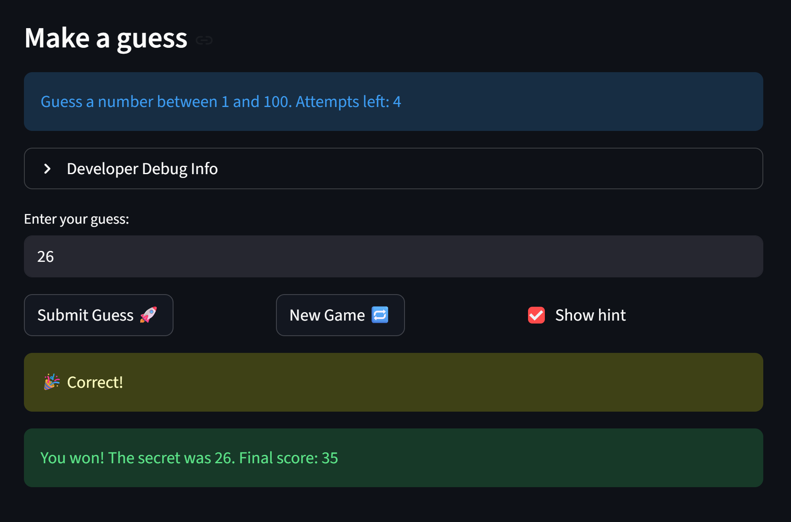

# 🎮 Game Glitch Investigator: The Impossible Guesser

## 🚨 The Situation

You asked an AI to build a simple "Number Guessing Game" using Streamlit.
It wrote the code, ran away, and now the game is unplayable. 

- You can't win.
- The hints lie to you.
- The secret number seems to have commitment issues.

## 🛠️ Setup

1. Install dependencies: `pip install -r requirements.txt`
2. Run the broken app: `python -m streamlit run app.py`

## 🕵️‍♂️ Your Mission

1. **Play the game.** Open the "Developer Debug Info" tab in the app to see the secret number. Try to win.
2. **Find the State Bug.** Why does the secret number change every time you click "Submit"? Ask ChatGPT: *"How do I keep a variable from resetting in Streamlit when I click a button?"*
3. **Fix the Logic.** The hints ("Higher/Lower") are wrong. Fix them.
4. **Refactor & Test.** - Move the logic into `logic_utils.py`.
   - Run `pytest` in your terminal.
   - Keep fixing until all tests pass!

## 📝 Document Your Experience

- [ ] Describe the game's purpose.
The game's purpose is to let users guess a secret number within a certain range, with hints provided after each guess to help them find the correct answer. The difficulty number changes the range and number of allowed attempts.
- [ ] Detail which bugs you found.
The main bugs I found were: the hints for "higher" and "lower" were reversed, the secret number kept changing unexpectedly, the difficulty ranges were inconsistent, and guesses outside the allowed range didn't show an error. 
- [ ] Explain what fixes you applied.
I fixed these by correcting the hint logic, using Streamlit's session state to keep the secret number stable, enforcing the correct range for each difficulty, and showing errors for out-of-range guesses. I also refactored the main logic into `logic_utils.py` and wrote pytest cases to confirm all fixes. 

## 📸 Demo

## 🚀 Stretch Features

- [ ] [If you choose to complete Challenge 4, insert a screenshot of your Enhanced Game UI here]
